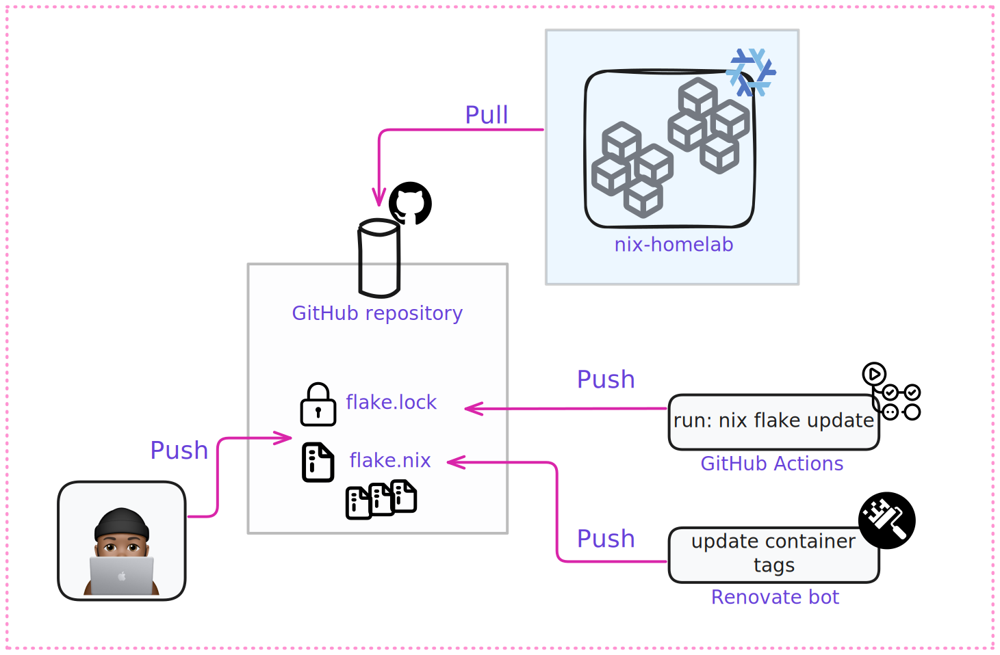
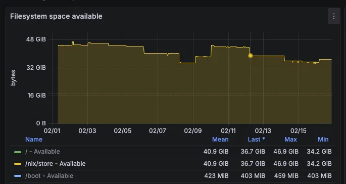

I recently migrated my homelab server from my [2011 Mac Mini](/2023/mac-mini-as-homeserver/) to a dedicated VM running on my NAS. I decided to go with [NixOS](https://nixos.org/) for its declarative configuration files, which enable reproducible and reliable setups.

As someone used to Debian/Ubuntu, jumping into NixOS feels like learning a new language. The thing I can say is thatNixOS isn't easy to get started with (even if the learning curve remains fun).

With a mix of GitOps, GitHub Actions, and Dependabot, I've achieved a state where my server stays consistently up to date. I also tackled few issues, such as growing storage, but found effective solutions to resolve them. Here is my walkthrough for maintaining an up-to-date self-hosted environment.


## The GitOps way

Since all my Infra as code is stored in GitHub it allows me to have all benefits of the GitOps approach. To be able to update my system frequently I have to put in place some sort of automation to sync my Nix configurations ([gaelgoth/nix-homelab](https://github.com/gaelgoth/nix-homelab)) with my environment.



Components overview of my homelab environment auto update:

- **GitHub Repository**: Store Nix configuration ([gaelgoth/nix-homelab](https://github.com/gaelgoth/nix-homelab))
- **nix-homelab**: VM running in my local network and it should be always synchronized with the configuration described in the GitHub repository
- **GitHub Actions**: GitHub Actions that update Nix packages
- **Renovate bot**: It takes care to update containers tags
- **(Me)**: For security reason I'm the only maintainer of my repo allowed of pushing changes on this repository. This avoid third party (apart from Renovate Bot and GitHub Actions) to update my environment

## NixOs packages updates

To keep my NixOS setup up-to-date, I use an automated upgrade process that fetches my system configuration from a Git repository. The first layer of updates includes the operating system itself and all installed NixOS packages.

Since I follow the GitOps principle, my server doesn't store configuration changes locally. Instead, it pulls the latest state from my [gaelgoth/nix-homelab](https://github.com/gaelgoth/nix-homelab) repository on GitHub. This ensures that my system remains in sync with my desired configuration.

The configuration below automates this process by periodically fetching updates from my repository and applying them

```nix
system.autoUpgrade = {
  enable = true;
  allowReboot = false;
  dates = "*-*-* 04:00:00";
  randomizedDelaySec = "1h";
  flake = "github:gaelgoth/nix-homelab";
};
```

This setup ensures that my system remains updated without manual intervention, while still giving me control over critical updates like kernel changes.

Once applied, logs of the systemd service `nixos-upgrade` can be retrieved like this:

```
$ systemctl status nixos-upgrade

○ nixos-upgrade.service - NixOS Upgrade
     Loaded: loaded (/etc/systemd/system/nixos-upgrade.service; linked; preset: ignored)
     Active: inactive (dead) since Sat 2025-02-15 04:25:05 CET; 17h ago
 Invocation: 21c8f0bef5704b578f9073afcd792ddc
TriggeredBy: ● nixos-upgrade.timer
    Process: 1228578 ExecStart=/nix/store/2361n8wnf94y5p1j1k4vv04dk8dbkak0-unit-script-nixos-upgrade-start/bin/nixos-upgrade-start (code=exited, status=0/SUCCESS)
   Main PID: 1228578 (code=exited, status=0/SUCCESS)
         IP: 0B in, 0B out
         IO: 292.9M read, 18.3M written
   Mem peak: 1.2G
        CPU: 33.658s

Feb 15 04:25:05 nixos-homelab-vm systemd[1]: nixos-upgrade.service: Deactivated successfully.
Feb 15 04:25:05 nixos-homelab-vm systemd[1]: Finished NixOS Upgrade.
Feb 15 04:25:05 nixos-homelab-vm systemd[1]: nixos-upgrade.service: Consumed 33.658s CPU time, 1.2G memory peak, 292.9M read from disk, 18.3M written to disk.
```

## GitHub Actions to update `flake.lock`

This step uses CI to refresh the `flake.lock` file, which is a snapshot that locks all dependencies to specific versions. These pinned versions can be updated by running the command `nix flake update`. To automate this process, I've set up a cron GitHub Actions workflow that runs on daily basis.

This GitHub Action is scheduled to run before the NixOS upgrade that starts approximately after 4:00 AM Swiss time (CET/CEST):

```yaml
name: cron Update flake.lock
on:
  schedule:
    # Run every day at 4:00 AM Swiss time (CET/CEST)
    - cron: '0 3 * * *'
  workflow_dispatch:
jobs:
  build:
    runs-on: ubuntu-latest
    permissions:
      contents: write
    steps:
      - uses: actions/checkout@v4
        with:
          fetch-depth: 0
      - uses: cachix/install-nix-action@v30
      - run: nix flake update
      - uses: stefanzweifel/git-auto-commit-action@v5
        with:
          commit_message: 'chore(deps): bump flake.lock'
          commit_user_name: Flake Bot Update
          commit_author: Flake Bot Update <actions@github.com>
          branch: main
          file_pattern: flake.lock
          skip_dirty_check: false
          skip_fetch: true
```

## Containers update

Most of the services that run in my homelab are containers. To keep them up to date, I use Renovate bot. By default, Renovate detects image tags in well-known container files such as `Dockerfile` and `docker-compose.yml`. However, in my configuration, I migrated all my `docker-compose.yml` files into [Podman nix configurations](https://nixos.wiki/wiki/Podman#Run_Podman_containers_as_systemd_services), which are unknown to Renovate.

To remediate this, I instructed Renovate that my `*.nix` files contain patterns like `image = "grafana/grafana:11.5.0";` and should be treated as container dependencies. To maintain a smooth GitOps process, Renovate Bot is allowed to auto-merge Pull Requests for minor and patch versions. So it give me room to review in case of major update:

```json
{
  "$schema": "https://docs.renovatebot.com/renovate-schema.json",
  "extends": ["config:recommended"],
  "customManagers": [
    {
      "customType": "regex",
      "fileMatch": [".*\\.nix$"],
      "matchStrings": ["image\\s*=\\s*\"(?<depName>[\\w./-]+):(?<currentValue>[\\w.-]+)\""],
      "datasourceTemplate": "docker",
      "versioningTemplate": "docker"
    }
  ],
  "packageRules": [
    {
      "matchUpdateTypes": ["patch", "minor"],
      "automerge": true,
      "schedule": ["before 3am"],
      "matchManagers": ["regex"],
      "description": "Auto-merge patch and minor containers"
    }
  ]
}
```

## Storage optimization

The setup looks pretty straightforward, right? However, after running nightly updates for a month, my monitoring quickly turned red and reached the threshold I set for disk usage.



### NixOs Generations

This issue is caused by [NixOS Generations](https://nixos.wiki/wiki/Terms_and_Definitions_in_Nix_Project#generation). A Generation is created every time there is a modification to the system. While this is a very useful feature of NixOS, in my case, I was generating a new one every day, which then quickly filled up my disk

```sh
[gael@nixos-homelab-vm:~]# nixos-rebuild list-generations
Generation   Build-date           NixOS version           Kernel
253 current  2025-02-02 04:29:41  25.05.20250131.9189ac1  6.12.11
252          2025-02-01 04:35:22  25.05.20250131.9189ac1  6.12.11
251          2025-01-31 04:39:10  25.05.20250129.9a5db31  6.12.11
```

The solution for this is enabling the garbage collector. This configuration will run weekly cleanups by deleting generations older than 3 days:

```nix
nix.gc = {
  automatic = true;
  dates = "weekly";
  options = "--delete-older-than 3d";
};
```

### Packages

Packages take up space too! These frequent updates quickly fill up the `/nix/store` folder with newer or older packages.
Packages consume disk space too! My regular updates configuration rapidly fill up the `/nix/store` folder with with newer or older packages.

> Side note: Packages built by Nix are placed in the read-only Nix store, normally found in `/nix/store`. Each package is given a unique address specified by a cryptographic hash followed by the package name and version, for example `/nix/store/nawl092prjblbhvv16kxxbk6j9gkgcqm-git-2.14.1`

This unique addressing system means that different versions of the same package or packages built with different dependencies will each occupy their own space in the store, which can lead to significant disk usage over time.

The [nix.optimise](https://nixos.wiki/wiki/Storage_optimization) option helps keep the `/nix/store` with only the needed packages.

Just a heads-up: This optimization is pretty CPU-intensive, so I schedule it for early mornings once a week to keep things running smoothly:

```nix
nix.optimise = {
  automatic = true;
  dates = [ "Sun 03:00" ];
};
```

### Containers

Last but not least, container optimization is also important since most of my services are containerized. The [podman.autoPrune](https://docs.podman.io/en/stable/markdown/podman-system-prune.1.html) option removes all dangling images from local storage, ensuring that I keep only images associated with running containers:

```nix
virtualisation = {
  podman = {
    enable = true;
    autoPrune = {
      enable = true;
      dates = "weekly";
    };
  };
};
```

# Final thoughts

I have been running this process for the past 4 months, and (fingers crossed 🤞) I haven't had a single issue with it. My server runs the DHCP service via [AdGuard Home](https://github.com/adguardTeam/adGuardHome/wiki/DHCP) in my household. So far, no complaints from anyone at home, which is a good sign of my server stability.

That said, my setup works well because it's a single-user, single-system configuration. If you're doing something more advanced, like sharing your configuration across multiple systems, things could get more harder.

All my `.nix`files can be found in my repository. There is still a bit of work, I plan to continue improving by reducing duplication and leveraging more Nix language mechanisms in the future.

<script lang="ts">
  import Github from '$lib/components/extra/github.svelte'
</script>

<Github user='gaelgoth' repo='nix-homelab'/>

## Useful resources ✨

- [Where I get inspirations for updating flake.lock](https://github.com/reckenrode/nixos-configs/blob/main/hosts/meteion/configuration.nix)
- [Podman NixOs Doc](https://nixos.wiki/wiki/Podman)
- [Storage Optimization](https://nixos.wiki/wiki/Storage_optimization)
- [Garbage Collector](https://nixos.org/guides/nix-pills/11-garbage-collector.html)
